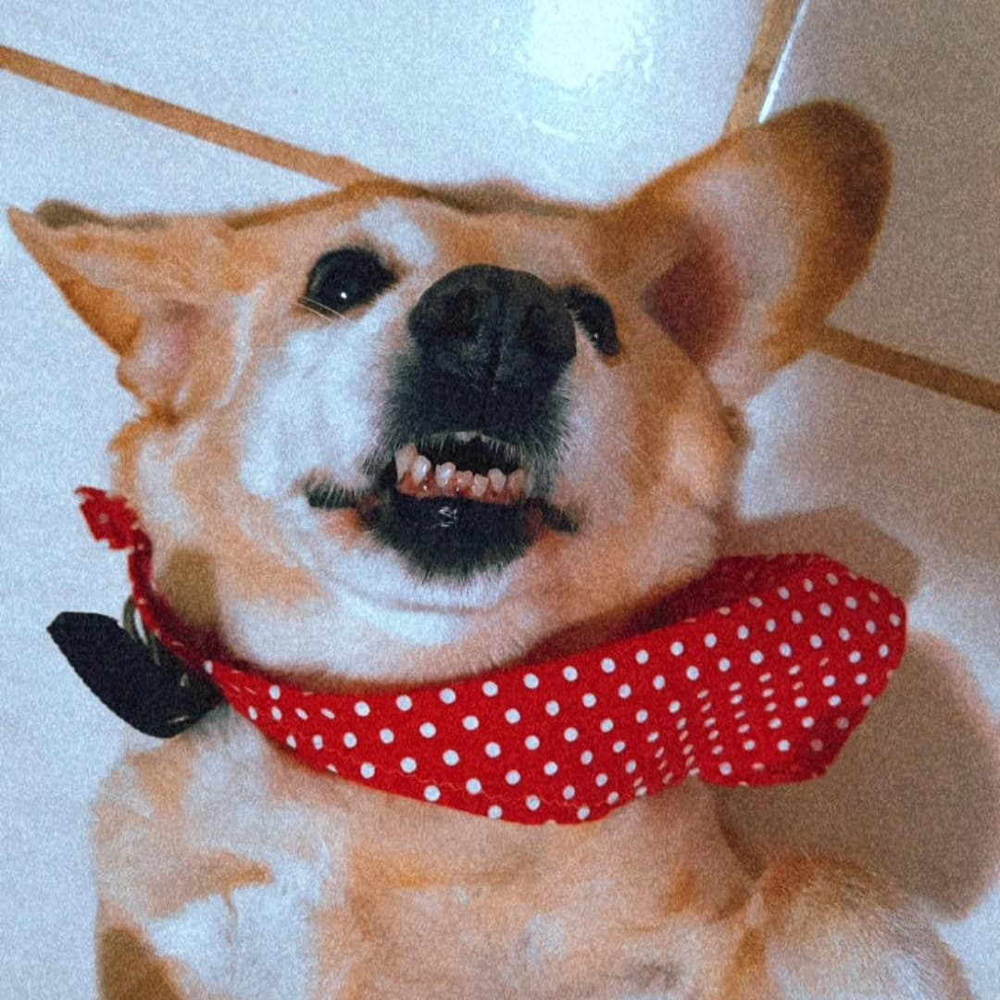

# Pitty - The Dog
Projeto simples feito apenas em HTML para treinar habilidades de criação de pastas.

Clique <a href="https://isabellacpmelo.github.io/dark-mode/">aqui</a> para acessar o projeto.

<a href="https://isabellacpmelo.github.io/dark-mode/"> 

## Ferramentas utilizadas:
- HTML5
